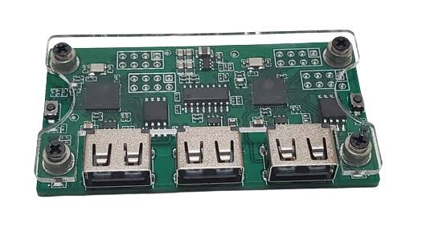

# Start Vision Assistant

  

# Smart Vision Assistant

Проект устройства для помощи слабовидящим людям на базе **ESP32-S3 (MAKCU)**, двух ультразвуковых датчиков **HC-SR04** и двух вибромоторов.

Устройство определяет препятствия перед пользователем и сообщает о них с помощью вибрации. Два датчика позволяют отдельно определять препятствия с левой и правой стороны.

## Как работает устройство

ESP32 постоянно получает данные с двух датчиков HC-SR04 и рассчитывает расстояние до объектов.

Каждый датчик связан со своим вибромотором:

* левый датчик обнаруживает препятствия слева;
* правый датчик обнаруживает препятствия справа.

Чем ближе находится препятствие, тем сильнее работает соответствующий вибромотор.

Пример:

* дальше 200 см — вибрации нет;
* 120–200 см — слабая вибрация;
* 60–120 см — средняя вибрация;
* 30–60 см — сильная вибрация;
* ближе 30 см — максимальная вибрация.

Датчики работают по очереди, чтобы ультразвуковые сигналы не мешали друг другу.

## Используемые компоненты

  

 

* MAKCU с ESP32-S3;
* 2 × HC-SR04;
* 2 × vibration motor;
* транзисторы для управления вибромоторами;
* защитные диоды;
* резисторы;
* источник питания.

## Используемые GPIO

Текущая версия прошивки использует:

| Компонент             |   GPIO |
| --------------------- | -----: |
| Left HC-SR04 TRIG     |  GPIO4 |
| Left HC-SR04 ECHO     |  GPIO5 |
| Right HC-SR04 TRIG    |  GPIO6 |
| Right HC-SR04 ECHO    |  GPIO7 |
| Left vibration motor  |  GPIO8 |
| Right vibration motor | GPIO10 |

Для линий `ECHO` используются делители напряжения, так как HC-SR04 работает с уровнем 5 В, а ESP32-S3 — с 3.3 В.

## Прошивка

Первая версия прошивки уже готова.

Прошивка:

* измеряет расстояние с двух HC-SR04;
* поочерёдно запускает датчики;
* определяет расстояние до препятствия;
* регулирует силу вибрации с помощью PWM;
* отдельно управляет левым и правым вибромотором;
* выводит расстояние и силу вибрации в Serial Monitor.

Основной файл прошивки:

`smart_vision_assistant.ino`

