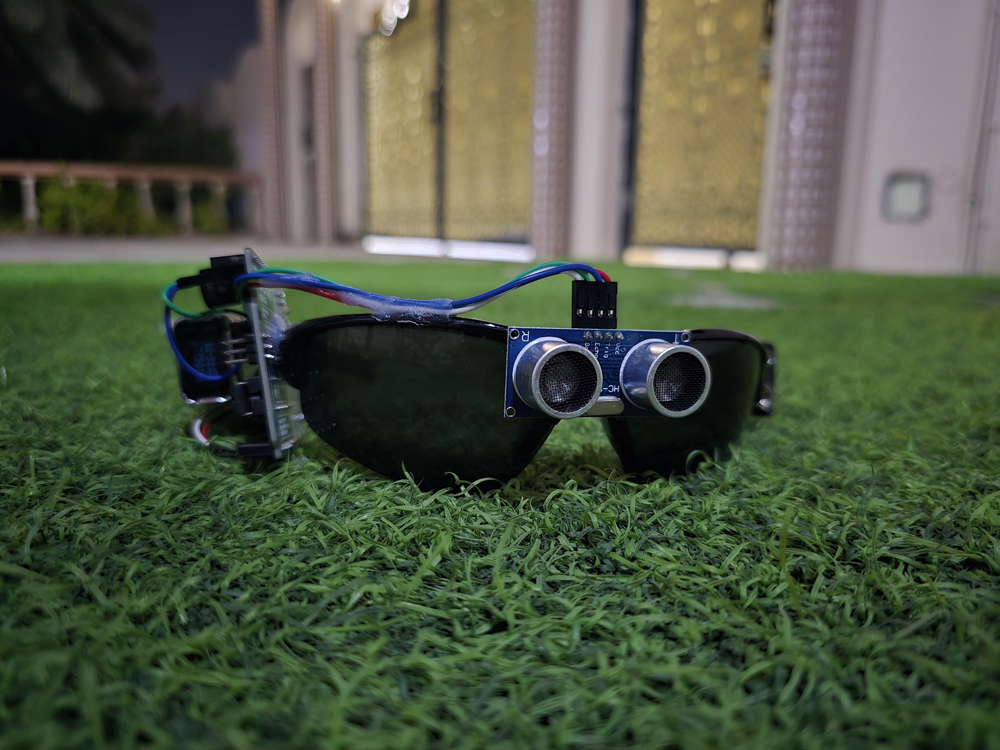

# glasses-for-the-visually-impaired

  

# Smart Vision Assistant

Проект устройства для помощи слабовидящим людям на базе **ESP32-S3 (MAKCU)** и двух ультразвуковых датчиков.

Устройство определяет препятствия перед пользователем и сообщает о них с помощью вибрации или звукового сигнала. Два ультразвуковых датчика позволяют отдельно определять препятствия с левой и правой стороны.

## Цель проекта

Создать компактное и недорогое устройство, которое поможет слабовидящему человеку лучше ориентироваться в пространстве и заранее замечать препятствия.

## Как работает устройство

ESP32 постоянно получает данные с двух ультразвуковых датчиков и рассчитывает расстояние до объектов.

В зависимости от расстояния устройство может изменять интенсивность вибрации или частоту звукового сигнала:

* далеко — слабый сигнал;
* препятствие ближе — более частый или сильный сигнал;
* очень близко — сильное предупреждение.

Левый датчик отвечает за препятствия слева, а правый — справа.

## Используемые компоненты

  

 
* MAKCU с ESP32-S3;
* 2 ультразвуковых датчика HC-SR04;
* вибромоторы или пьезодинамик;
* резисторы для согласования уровня сигнала;
* источник питания.

## Возможности проекта

* обнаружение препятствий в реальном времени;
* определение направления препятствия;
* регулировка силы предупреждения в зависимости от расстояния;
* возможность дальнейшего добавления новых датчиков;
* возможность подключения GPS, Bluetooth, динамика или других модулей.

## Статус

Проект находится в разработке. Сейчас разрабатывается схема подключения датчиков и прошивка для ESP32-S3.
